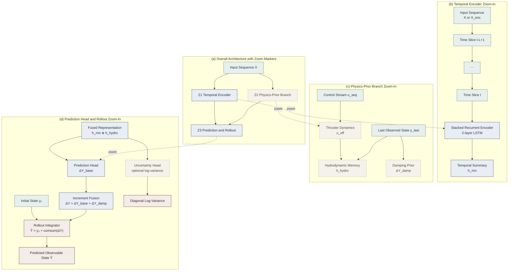

# 历史 Mermaid 草图

说明：

- 本文档保存历史阶段的 Mermaid 图草稿。
- 它不作为当前主线设计说明入口，只做归档保留。
- 当前主线请优先参考 `README.md`、`ARCHITECTURE.md` 与 `docs/design/` 下的文档。

---

## 图 1：网络整体架构图

```mermaid
flowchart LR
classDef data fill:#E8F0EE,stroke:#6F8F8B,stroke-width:1.2px,color:#243238;
classDef learned fill:#E9EDF4,stroke:#5B6C8D,stroke-width:1.3px,color:#233041;
classDef prior fill:#F5F2EC,stroke:#B6ABA1,stroke-width:1.2px,stroke-dasharray: 5 3,color:#4A4640;
classDef out fill:#F3ECE8,stroke:#8F6E63,stroke-width:1.6px,color:#352B27;
classDef note fill:#F8F8F8,stroke:#C8C8C8,stroke-width:0.8px,color:#666666;

A1["PWM History<br/>L × 8"]:::data
A2["IMU History<br/>L × 6"]:::data
A3["Velocity-State History<br/>L × 3"]:::data
A4["Power Context<br/>L × 8"]:::data

A1 --> X["Input Sequence X<br/>L = 100, D = 25"]:::data
A2 --> X
A3 --> X
A4 --> X

X --> P["Input Stream Partition<br/><span style='font-size:11px'>control stream / state stream</span>"]:::data

P --> ENC["Temporal Encoder<br/><span style='font-size:11px'>2-layer LSTM backbone</span>"]:::learned
P --> THR["Thruster Dynamics<br/><span style='font-size:11px'>optional lag prior</span>"]:::prior
P --> HYD["Hydrodynamic Memory<br/><span style='font-size:11px'>optional HydroSSM branch</span>"]:::prior

THR --> UEFF["Lag-Compensated Control<br/><span style='font-size:11px'>u_eff</span>"]:::learned
UEFF --> ENC

ENC --> FUSE["Feature Fusion<br/><span style='font-size:11px'>h_rnn ⊕ h_hydro</span>"]:::learned
HYD --> FUSE

FUSE --> HEAD["State Increment Head<br/><span style='font-size:11px'>predict ΔY_base</span>"]:::learned
FUSE --> UNC["Uncertainty Head<br/><span style='font-size:11px'>optional log-variance</span>"]:::prior

P --> Y0["Initial State Extractor<br/><span style='font-size:11px'>y₀ from last observed state</span>"]:::data
P --> DAMP["Damping Prior<br/><span style='font-size:11px'>optional ΔY_damp</span>"]:::prior

HEAD --> ADD["Increment Fusion<br/><span style='font-size:11px'>ΔY = ΔY_base + ΔY_damp</span>"]:::learned
DAMP --> ADD

ADD --> ROLL["Rollout Integrator<br/><span style='font-size:11px'>Ŷ = y₀ + cumsum(ΔY)</span>"]:::out
Y0 --> ROLL

ROLL --> OUT["Predicted Observable State<br/><span style='font-size:11px'>H × 9: Acc | Gyro | Velocity</span>"]:::out
UNC --> LOGV["Diagonal Log-Variance<br/><span style='font-size:11px'>H × 9</span>"]:::out

N1["Optional physics-inspired branches"]:::note
N1 -.-> THR
N1 -.-> HYD
N1 -.-> DAMP
```

---

## 图 2：网络局部放大图

---

## 图 3：方法流程与实验框架图

```mermaid
flowchart LR
classDef data fill:#E8F0EE,stroke:#6F8F8B,stroke-width:1.2px,color:#243238;
classDef prep fill:#EEF1E7,stroke:#7D8B73,stroke-width:1.2px,color:#2C3528;
classDef learned fill:#E9EDF4,stroke:#5B6C8D,stroke-width:1.2px,color:#233041;
classDef eval fill:#F4F1E8,stroke:#9A8F6A,stroke-width:1.2px,color:#403A2B;
classDef optional fill:#F5F2EC,stroke:#B6ABA1,stroke-width:1.2px,stroke-dasharray: 5 3,color:#4A4640;
classDef emph fill:#EAF4EC,stroke:#5E8A68,stroke-width:2px,color:#233428;

subgraph A["Raw Multi-Rate Logs"]
PWM["PWM<br/>100 Hz"]:::data
IMU["IMU<br/>100 Hz"]:::data
DVL["DVL<br/>10 Hz"]:::data
PWR["Power<br/>low-rate"]:::data
end

A --> Align["Temporal Alignment<br/>shared timeline construction"]:::prep
Align --> State["State Construction<br/>Inputs: PWM + IMU + Velocity + Power<br/>Targets: Acc + Gyro + Velocity"]:::prep
State --> Mask["Sparse Supervision Masking<br/>target_mask from dvl_mask"]:::prep
State --> Win["Sliding-Window Generation<br/>X:(L,25), Y:(H,9), idx0"]:::prep
Mask --> Win

Win --> Split["Purged Temporal Split<br/>contiguous_purged_v2<br/>no raw-support overlap"]:::emph
Split --> Norm["Train-Subset Normalization<br/>fit scalers on train only"]:::prep

Norm --> Neural["Neural Training<br/>S1Predictor + masked NLL"]:::learned
Norm --> Base["Baseline Runner<br/>Trivial Last | Classical Ridge"]:::optional

Split --> Contract["Unified Split and Scaling Protocol"]:::eval
Norm --> Contract
Contract --> Eval["Shared Evaluation Protocol<br/>same rollout | same metrics | same artifacts"]:::eval

Neural --> Eval
Base --> Eval

Eval --> Summary["Matrix Summary and Reporting<br/>summary.csv | per-run logs"]:::eval
Eval --> Snap["Provenance Snapshot<br/>resolved_train / eval / baseline yaml"]:::eval
Eval --> Dash["Metrics Dashboard and Plots<br/>horizon | tail | growth | bias"]:::eval
```

---

#
